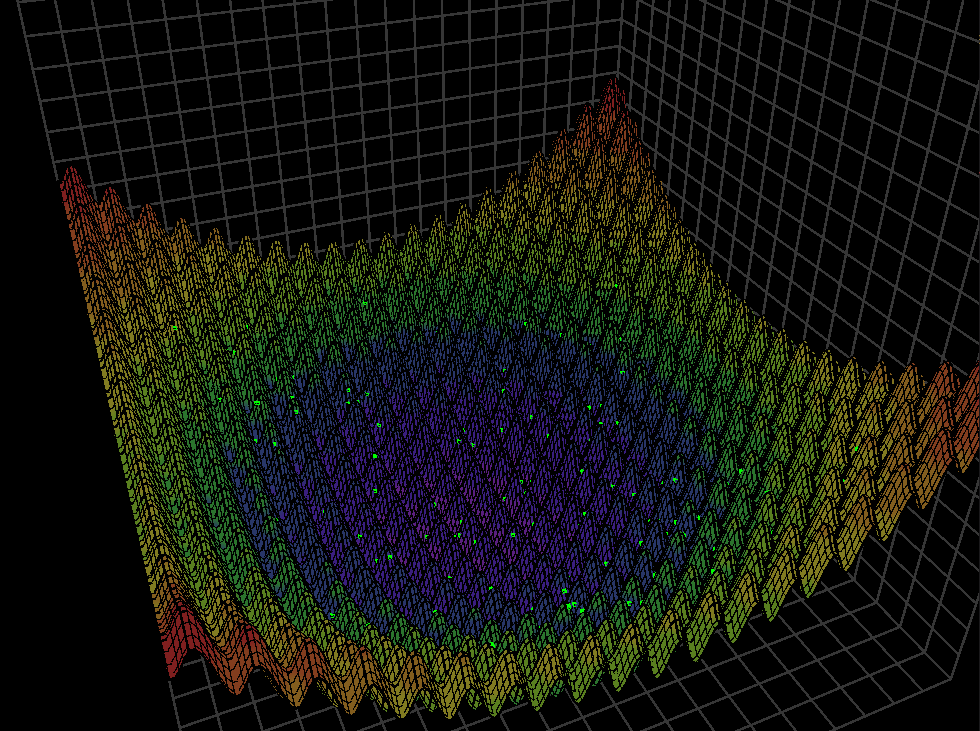

# racani
Course work as a part of Computer Animation course; including Visualization of genetic algorithm global optimization of functions of two variables implemented in C++ + OpenGL.

```
cd 3lab
cmake .
cmake --build .
./3lab
```
[Video](https://youtu.be/b7rksfEpddI)

